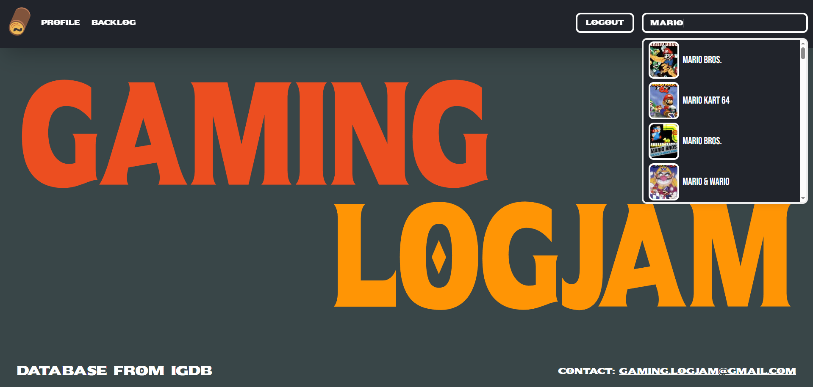
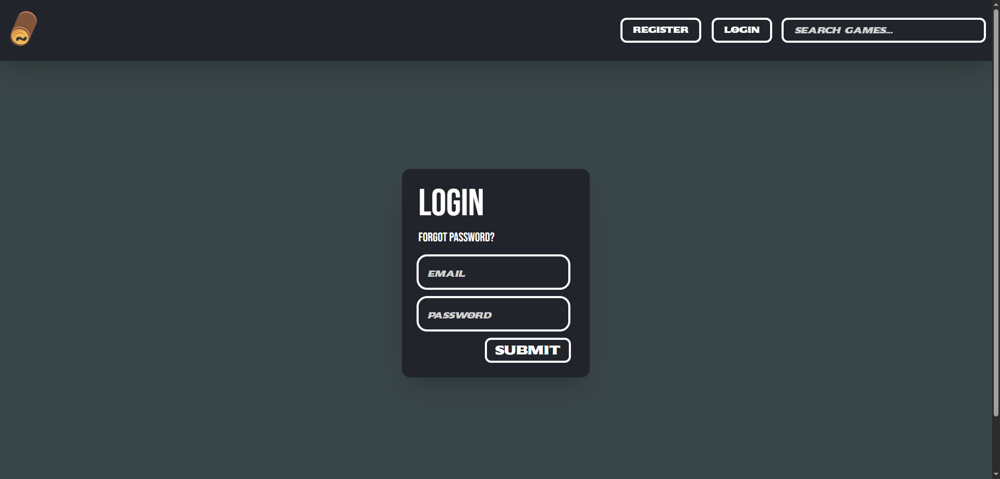
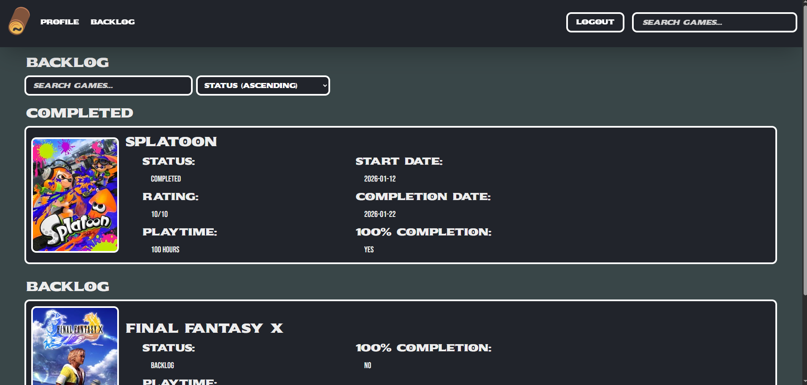
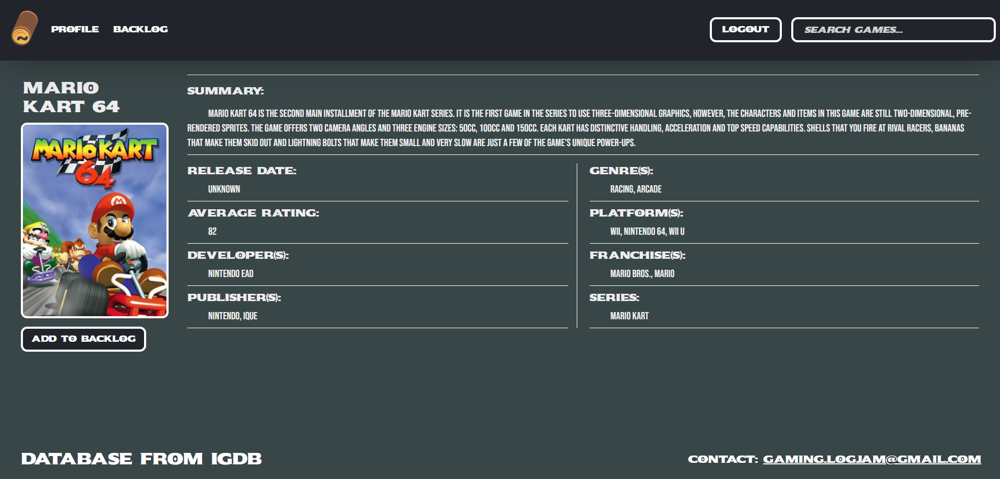
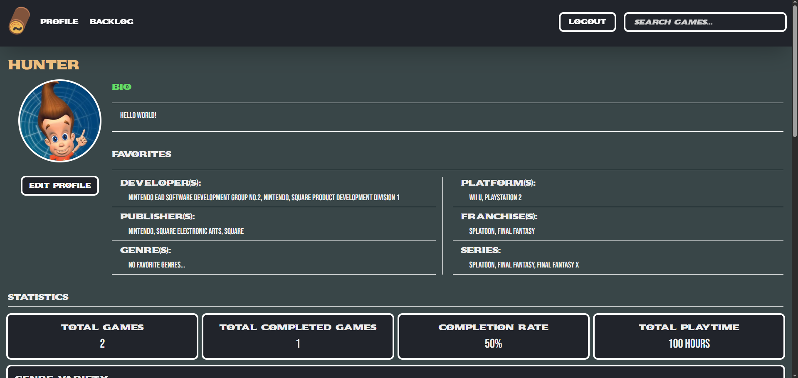
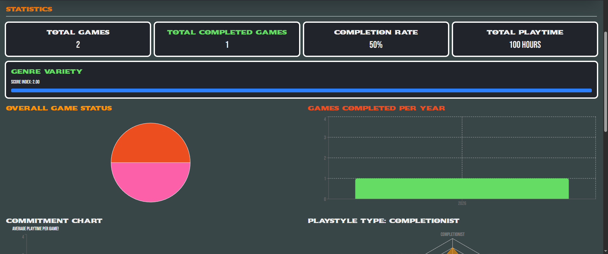

# Gaming Logjam (Backlog Tracker) @ https://gaminglogjam.com
<!-- Improved compatibility of back to top link: See: https://github.com/othneildrew/Best-README-Template/pull/73 -->
<a id="readme-top"></a>
<!--
*** Thanks for checking out the Best-README-Template. If you have a suggestion
*** that would make this better, please fork the repo and create a pull request
*** or simply open an issue with the tag "enhancement".
*** Don't forget to give the project a star!
*** Thanks again! Now go create something AMAZING! :D
-->


<!-- PROJECT SHIELDS -->
<!--
*** I'm using markdown "reference style" links for readability.
*** Reference links are enclosed in brackets [ ] instead of parentheses ( ).
*** See the bottom of this document for the declaration of the reference variables
*** for contributors-url, forks-url, etc. This is an optional, concise syntax you may use.
*** https://www.markdownguide.org/basic-syntax/#reference-style-links
-->
[![Contributors][contributors-shield]][contributors-url]
[![Forks][forks-shield]][forks-url]
[![Stargazers][stars-shield]][stars-url]
[![Issues][issues-shield]][issues-url]
[![MIT License][license-shield]][license-url]
[![LinkedIn][linkedin-shield]][linkedin-url]


<!-- PROJECT LOGO -->
<br />
<div align="center">
  <a href="https://github.com/huntercademast/backlog-tracker">
    
  </a>

<h3 align="center">Full Stack Web App</h3>

  <p align="center">
    https://www.gaminglogjam.com/
    <br />
    <a href="https://github.com/huntercademast/backlog-tracker"><strong>Explore the docs »</strong></a>
    <br />
    <br />
    <a href="https://github.com/huntercademast/backlog-tracker/issues/new?labels=bug&template=bug-report---.md">Report Bug</a>
    &middot;
    <a href="https://github.com/huntercademast/backlog-tracker/issues/new?labels=enhancement&template=feature-request---.md">Request Feature</a>
  </p>
</div>


<!-- TABLE OF CONTENTS -->
<details>
  <summary>Table of Contents</summary>
  <ol>
    <li><a href="#about-the-project">About The Project</a></li>
    <li><a href="#features">Features</a></li>
    <li><a href="#architecture-overview">Architecture Overview</a></li>
    <li><a href="#why-this-project">Why This Project?</a></li>
    <li>
      <a href="#getting-started">Getting Started</a>
      <ul>
        <li><a href="#prerequisites">Prerequisites</a></li>
        <li><a href="#local-development">Local Development</a></li>
      </ul>
    </li>
    <li><a href="#technical-highlights">Technical Highlights</a></li>
    <li><a href="#lessons-learned">Lessons Learned</a></li>
    <li><a href="#screenshots--usage">Screenshots & Usage</a></li>
    <li><a href="#roadmap">Roadmap</a></li>
    <li><a href="#license">License</a></li>
    <li><a href="#contact">Contact</a></li>
  </ol>
</details>


<!-- ABOUT THE PROJECT -->
## About The Project

[![Product Name Screen Shot][product-screenshot]](https://gaminglogjam.com)

**Gaming Logjam** is a full-stack web application created for the purpose of providing a way for tracking your video game backlog, play history, and statistics based on use.

Users can:
- Track backlogged, playing, paused, dropped, and completed games.
- Customize profiles with public/private option, bio, username, favorite game, and more.
- Upload personal profile photos.
- Generate API keys for usage tracking.
- Receive in-depth information on their favorite developers, publishers, and more.

This project is built as a **production-ready** system, featuring authentication, background jobs, media storage, rate limiting, and robust API security.

🌐 Live Site: https://www.gaminglogjam.com  
📡 API: https://api.gaminglogjam.com

<p align="right">(<a href="#readme-top">back to top</a>)</p>

## Features

### Core
- User authentication.
- REST API with JWT authentication.
- Public and private user profiles (Access through https://www.gaminglogjam.com/user/username).
- Game backlog management.
- Profile image uploads with automatic resizing.

### Integrations
- IGDB API for game metadata.
- Cloudflare R2 object storage.

### Backend & Infrastructure
- Django REST Framework API.
- API key management & rotation.
- Rate limiting & throttling.
- Celery background jobs.
- Redis caching.
- PostgreSQL database.

### Security
- JWT-based authentication for API access.
- API key throttling and rate limiting.
- Django CSRF protection for admin and session-based endpoints.

### Built With

#### Frontend
* [![Next.js][Next.js]][Next-url]
* [![React][React.js]][React-url]

#### Backend
* [![Django][Django-badge]][Django-url]
* [![DRF][DRF-badge]][DRF-url]

#### Database & Caching
* [![PostgreSQL][Postgres-badge]][Postgres-url]
* [![Redis][Redis-badge]][Redis-url]

#### Background Jobs
* [![Celery][Celery-badge]][Celery-url]

#### Infrastructure & APIs
* [![Cloudflare][Cloudflare-badge]][Cloudflare-url]
* IGDB API

## Architecture Overview

- **Frontend:** Next.js application with integrated REST API.
- **Backend:** Django REST Framework API.
- **Database:** PostgreSQL.
- **Storage:** Cloudflare R2 (S3-compatible).
- **Authentication:** JWT.
- **Background Tasks:** Celery and Redis.

## Why This Project?

I built Gaming Logjam to deepen my understanding of:

- Full-stack architecture.
- Production Django APIs.
- Authentication & security.
- Background job processing.
- Scalable object storage.
- Real-world deployment.

This project reflects how I approach building real systems.

<p align="right">(<a href="#readme-top">back to top</a>)</p>


<!-- GETTING STARTED -->
## Getting Started

### Prerequisites
- Python 3.12+
- Node.js 18+
- PostgreSQL
- Redis
- Cloudflare R2 account (for media uploads)

## Local Development

This project is deployed and live at:
- https://www.gaminglogjam.com
- https://api.gaminglogjam.com

Local setup is intended for development and testing only.

### Backend
```bash
git clone https://github.com/huntercademast/backlog-tracker.git
cd backend
python -m venv venv
source venv/bin/activate
pip install -r requirements.txt
```

### Environment Variables

Environment variables are required for database access, authentication, media storage, and third-party APIs.

A `.env` file is used for local development and is not included in version control!

## Technical Highlights

- Designed and deployed a full-stack production application.
- Implemented JWT authentication with secure token handling.
- Integrated third-party APIs (IGDB) with caching and rate limiting.
- Used Cloudflare R2 for scalable object storage.
- Implemented background tasks using Celery and Redis.
- Designed a RESTful API consumed by a Next.js frontend.

## Lessons Learned

- Designing a clean API connection between frontend and backend significantly reduced iteration time.
- Stateless JWT authentication simplified scaling and deployment.
- Background tasks were essential for keeping the API responsive under load.
- Authentication required careful view of permissions and public access.

<p align="right">(<a href="#readme-top">back to top</a>)</p>


<!-- USAGE EXAMPLES -->
## Screenshots & Usage

### Search & Add Games
Search for games using IGDB-powered metadata and add them to your backlog.



---

### Authentication
Secure user authentication using JWT-based login.



---

### Backlog Management
View and manage your backlog, including status updates and progress tracking.



---

### Game Details
View detailed information about games, including metadata and personal status.



---

### User Profile
Customize and view public or private user profiles.



---

### Statistics & Insights
Track play history and view statistics about your gaming habits.



<p align="right">(<a href="#readme-top">back to top</a>)</p>


<!-- ROADMAP -->
## Roadmap

- [x] User authentication.
- [x] IGDB integration.
- [x] Profile customization.
- [x] Media storage for images.
- [x] Mobile-friendly UI.
- [x] OAuthentication.
- [x] Email verification.
- [ ] Terminal for logging.
- [ ] Advanced recommendation system.
- [ ] Social features.
  - [ ] Friends.
  - [ ] Activity.
- [ ] Steam integration.

<p align="right">(<a href="#readme-top">back to top</a>)</p>


<!-- LICENSE -->
## License

Distributed under the MIT License. See `LICENSE.txt` for more information.

<p align="right">(<a href="#readme-top">back to top</a>)</p>


<!-- CONTACT -->
## Contact

Hunter Mast - huntercademast@gmail.com - gaming.logjam@gmail.com

Project Link: [https://github.com/huntercademast/backlog-tracker](https://github.com/huntercademast/backlog-tracker)

<p align="right">(<a href="#readme-top">back to top</a>)</p>

<!-- MARKDOWN LINKS & IMAGES -->
<!-- https://www.markdownguide.org/basic-syntax/#reference-style-links -->
[contributors-shield]: https://img.shields.io/github/contributors/huntercademast/backlog-tracker.svg?style=for-the-badge
[contributors-url]: https://github.com/huntercademast/backlog-tracker/graphs/contributors
[forks-shield]: https://img.shields.io/github/forks/huntercademast/backlog-tracker.svg?style=for-the-badge
[forks-url]: https://github.com/huntercademast/backlog-tracker/network/members
[stars-shield]: https://img.shields.io/github/stars/huntercademast/backlog-tracker.svg?style=for-the-badge
[stars-url]: https://github.com/huntercademast/backlog-tracker/stargazers
[issues-shield]: https://img.shields.io/github/issues/huntercademast/backlog-tracker.svg?style=for-the-badge
[issues-url]: https://github.com/huntercademast/backlog-tracker/issues
[license-shield]: https://img.shields.io/github/license/huntercademast/backlog-tracker.svg?style=for-the-badge
[license-url]: https://github.com/huntercademast/backlog-tracker/blob/master/LICENSE.txt
[linkedin-shield]: https://img.shields.io/badge/-LinkedIn-black.svg?style=for-the-badge&logo=linkedin&colorB=555
[linkedin-url]: https://linkedin.com/in/huntercademast
[product-screenshot]: frontend/backlog-tracker-next-js/public/images/screenshot.png
<!-- Shields.io badges. You can a comprehensive list with many more badges at: https://github.com/inttter/md-badges -->
[Next.js]: https://img.shields.io/badge/next.js-000000?style=for-the-badge&logo=nextdotjs&logoColor=white
[Next-url]: https://nextjs.org/
[React.js]: https://img.shields.io/badge/React-20232A?style=for-the-badge&logo=react&logoColor=61DAFB
[React-url]: https://reactjs.org/
[Django-badge]: https://img.shields.io/badge/Django-092E20?style=for-the-badge&logo=django&logoColor=white
[Django-url]: https://www.djangoproject.com/
[DRF-badge]: https://img.shields.io/badge/Django%20REST-ff1709?style=for-the-badge&logo=django&logoColor=white
[DRF-url]: https://www.django-rest-framework.org/
[Postgres-badge]: https://img.shields.io/badge/PostgreSQL-316192?style=for-the-badge&logo=postgresql&logoColor=white
[Postgres-url]: https://www.postgresql.org/
[Redis-badge]: https://img.shields.io/badge/Redis-DC382D?style=for-the-badge&logo=redis&logoColor=white
[Redis-url]: https://redis.io/
[Celery-badge]: https://img.shields.io/badge/Celery-37814A?style=for-the-badge&logo=celery&logoColor=white
[Celery-url]: https://docs.celeryq.dev/
[Cloudflare-badge]: https://img.shields.io/badge/Cloudflare-F38020?style=for-the-badge&logo=cloudflare&logoColor=white
[Cloudflare-url]: https://www.cloudflare.com/
